### 👋 Hey, I'm Ammar — Cybersecurity × Networking × AI

---

## 🛡️ About

**🛡️ Aspiring Cybersecurity Engineer&nbsp;|&nbsp;🌐 Networking & Network Security&nbsp;|&nbsp;🤖 AI & Security Automation**

I'm a B.Sc. Information Technology graduate building my way into cybersecurity through hands-on engineering, networking, security research, and AI-driven projects. I like understanding what happens under the hood — how networks communicate, how systems fail, how attacks work, how defenders detect them, and how automation can make security smarter.

**🧪 My approach:** Learn → Build → Break → Investigate → Fix → Automate → Repeat.

**🌐 Networking → 🔐 Security → 🕵️ Detection → 🤖 AI/Automation** — that's the intersection I care about.

> "The best way to understand a system is to build it, break it, and figure out why it broke."

---

## 🎓 Certifications

**Cisco**
- Endpoint Security
- Network Defense
- Networking Basics
- Introduction to Cybersecurity

**Coursera**
- AI For Everyone
- Launching into Machine Learning
- Introduction to AI and Machine Learning on Google Cloud
- Getting Started with Linux Terminal
- Foundations of Cybersecurity
- Introduction to Networking and Cloud Computing

---

## 🚀 Featured Projects

### 🛡️ [phishguard-ai](https://github.com/Ammy215/phishguard-ai) &nbsp;🟢 Completed
Flask backend combining a Random Forest ML model with a 16-rule heuristic engine, an explainable-AI chat endpoint, and live threat intel from Google Safe Browsing, PhishTank, and URLHaus. Ships with a React 19 + TypeScript + Radix UI dashboard and a Manifest V3 Chrome extension.
My most complete and functional repo end-to-end.

### 🍯 [Honeypot-system](https://github.com/Ammy215/Honeypot-system) — HoneyShield Intelligence Platform &nbsp;🟡 In Progress
Multi-protocol honeypot (SSH/FTP/HTTP/Telnet) built on asyncio + raw SQL, with threat-intel enrichment and an AI-assisted SOC dashboard. The HTTP honeypot is **actually running in production**; SSH/FTP/Telnet are built and tested but not yet deployed (a PaaS socket limitation, not a code gap).

### 📊 [Intelligent-Log-Analyzer](https://github.com/Ammy215/Intelligent-Log-Analyzer) &nbsp;🟡 In Progress
Async FastAPI + Motor/MongoDB + Pydantic v2 backend with a React 18 + Vite + Tailwind + Radix frontend, OpenAI API integration, and threat intel via AbuseIPDB, OTX, and geolocation lookups. Functional today; mid-rebuild toward a multi-tenant enterprise version with auth, RBAC, and billing.

### 🗂️ [Metadata-and-File-Analyzer](https://github.com/Ammy215/Metadata-and-File-Analyzer) — FileShield &nbsp;🟢 Completed
File intelligence platform: hashing, entropy analysis, YARA matching, and risk scoring, with an admin console. FastAPI + SQLAlchemy 2.0 + PostgreSQL backend, React 18 + Vite + Tailwind + Framer Motion frontend, Docker Compose locally with a Vercel + Render cloud target.

### 🌐 [Network-Anomaly-Detector](https://github.com/Ammy215/Network-Anomaly-Detector) — NetSentinel &nbsp;🟢 Completed
Watches network traffic, learns a baseline for "normal," flags what doesn't fit, and uses RAG-grounded AI (ChromaDB + LangGraph + Groq) to explain why and suggest next steps for an analyst — not just a raw anomaly score. FastAPI + scikit-learn backend with Scapy/PyShark packet capture, Supabase (Postgres) for auth/RBAC, React 19 + Vite + Tailwind frontend.
**[Live demo →](https://network-anomaly-detector-inky.vercel.app)** — dashboard, PCAP upload/analysis, ML scoring, AI investigation, and threat-intel enrichment are all live and free. Live packet capture is local-only (free hosting doesn't grant raw-socket access) — see the repo's README for running that piece locally.

---

## 🧰 Tech Stack

**Cybersecurity**

**Networking**

**AI / ML**

**Tools & Stack**

---

## 🟡 Near Launch

### 🕵️ [Threat-Hunter-Dashboard](https://github.com/Ammy215/Threat-Hunter-Dashboard) — ThreatHunter Intelligence Platform &nbsp;🟡 Near Launch
Next.js (App Router, TS) frontend, Express + TypeScript backend, Supabase (Postgres + Auth + RLS), Zod validation. IOC lookups (IP/domain/hash/URL) fanned out across AbuseIPDB, AlienVault OTX, IPInfo, VirusTotal, and NIST NVD, plus a Groq-powered AI assistant for querying investigation history. 89 automated tests (unit/integration/E2E) and a completed adversarial security-testing pass (8 findings, each fixed and retested).

All 16 build phases are complete; currently in final pre-deployment checks (an IPInfo key-rotation issue, a backend production-start bug, mobile responsive fixes, and a Resend/Supabase SMTP issue) targeting Render (backend) + Vercel (frontend).

Private repo — happy to walk through the code or share access on request.

---

## 🔵 Currently Building

These are early-stage and intentionally not in the featured list above yet:

- **[Mini-SIEM](https://github.com/Ammy215/Mini-SIEM)** &nbsp;🟡 In Progress — FastAPI + PostgreSQL SIEM with its own JWT + bcrypt + RBAC auth, React 18 + Vite + Tailwind + shadcn/ui + Recharts frontend. Per its own README: early, "Phase 0, repo hygiene."

---

## 🧠 Currently Exploring

Python • Linux • Networking • Network Security • SOC • Threat Detection • Web Security • APIs • Databases • Cloud • Machine Learning • RAG • MCP • AI Agents • LangChain • LangGraph • Security Automation

---

## 📈 GitHub Stats

---

## 🤝 Connect

<!-- Open to opportunities line — flagged for approval, see chat before pushing -->
📡 Open to entry-level SOC / detection engineering opportunities.

